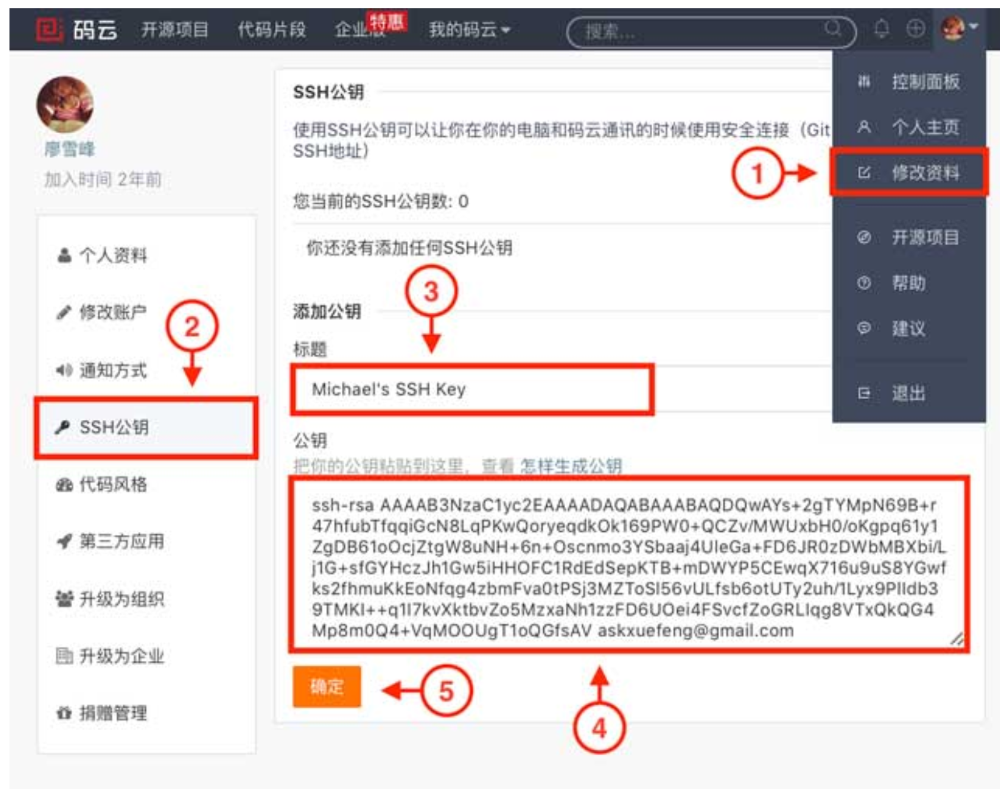
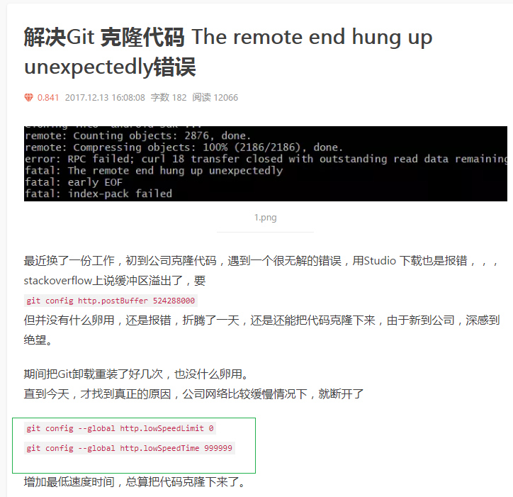

# git常用

## git-廖雪峰

[Git教程--廖雪峰](https://www.liaoxuefeng.com/wiki/896043488029600)

## git安装
```javascript
1. 下载安装包，安装
2. 在开始菜单里找到“Git”->“Git Bash”
3. 安装完成后，还需要最后一步设置，在命令行输入：
`
git config --global user.name "Your Name"
git config --global user.email "email@example.com"
`
因为Git是分布式版本控制系统，所以，每个机器都必须自报家门：你的名字和Email地址。
```
## 版本回退
```js
git reset --hard commitId // 回退到某个commitId版本
git log // 查看提交历史 ()
git log --graph // 可以看到分支合并图
git reflog // 查看命令历史，以便确定要回到未来的哪个版本
```
:::tip
ps :  git reflog
如果用git reset回退到以前的版本后，最新的已经看不到了。如果当前命令窗口还没有关掉，找到最新的那个commitId，就可以再此利用git reset --hard commitId 回到最新版本
如果用git reset回退到以前的版本后，最新的已经看不到了。并且命令窗口已经关掉。则可用git reflog查看到所有提交的版本信息，在找到最新的那个commitId，再此利用git reset --hard commitId 回到最新版本
:::

## 撤销修改
```js
git checkout -- readme.txt // 把readme.txt文件在工作区的修改全部撤销
git reset HEAD <file> // 可以把暂存区的修改撤销掉（unstage），重新放回工作区。git reset命令既可以回退版本，也可以把暂存区的修改回退到工作区
```
:::tip
ps : git checkout 这里有两种情况
一种是readme.txt自修改后还没有被放到暂存区，现在，撤销修改就回到和版本库一模一样的状态；
一种是readme.txt已经添加到暂存区后，又作了修改，现在，撤销修改就回到添加到暂存区后的状态。
总之，就是让这个文件回到最近一次git commit或git add时的状态。
git checkout -- file命令中的--很重要，没有--，就变成了“切换到另一个分支”的命令
:::

## ssh key

1. 创建SSH Key
  Git Bash->ssh-keygen -t rsa -C "youremail@example.com"
  然后一路回车，使用默认值即可
  
  如果一切顺利的话，可以在用户主目录里找到.ssh目录，里面有id_rsa和id_rsa.pub两个文件，这两个就是SSH Key的秘钥对，id_rsa是私钥，不能泄露出去，id_rsa.pub是公钥，可以放心地告诉任何人。
2. 登陆GitHub，打开“Account settings”，“SSH Keys”页面
  
  点“Add SSH Key”，填上任意Title，在Key文本框里粘贴id_rsa.pub文件的内容
  

  :::tip
    为什么GitHub需要SSH Key呢？因为GitHub需要识别出你推送的提交确实是你推送的，而不是别人冒充的，而Git支持SSH协议，所以，GitHub只要知道了你的公钥，就可以确认只有你自己才能推送。

    当你第一次使用Git的clone或者push命令连接GitHub时，会得到一个警告：

    ```js
    The authenticity of host 'github.com (xx.xx.xx.xx)' can't be established.
    RSA key fingerprint is xx.xx.xx.xx.xx.
    Are you sure you want to continue connecting (yes/no)?
    ```

    这是因为Git使用SSH连接，而SSH连接在第一次验证GitHub服务器的Key时，需要你确认GitHub的Key的指纹信息是否真的来自GitHub的服务器，输入yes回车即可。
  :::

  ## 分支

:::tip
  git checkout -b dev //创建+切换dev分支(git branch dev 和 git checkout dev 2步合成的)
  git branch // 列出所有分支，当前分支前面会标一个*号
  git merge dev // 用于合并指定分支到当前分支,默认用的是‘Fast-forward（快进模式）’
  git branch -d dev // 删除dev分支
  git checkout -b newbranch oldbranch 根据已有分支创建新的分支
:::

## 打标签

```js
  打标签：
  git tag v1.0  //打一个新标签
  git tag // 查看所有标签
  git show v0.9 // 查看标签信息
  git tag -a v0.1 -m "version 0.1 released" 1094adb // 还可以创建带有说明的标签，用-a指定标签名，-m指定说明文字
  git push origin v1.0 // 推送某个标签到远程 
  git push origin --tags // 一次性推送全部尚未推送的标签到远程的本地标签
  ps: 
  1.默认标签是打在最新提交的commit上的。有时候，如果忘了打标签, 
  需要在以前的某个commitId-f52c633上打标签,git tag v0.9 f52c633`
  2. 标签总是和某个commit挂钩。如果这个commit既出现在master分支，又出现在dev分支，那么在这两个分支上都可以看到这个标签。

  删除标签：
  1. 还未推送到远程，只是在本地打了标签,则只需要删除本地标签
  git tag -d v0.9
  2. 如果标签已经推送到远程
  git tag -d v0.9 // 先删除本地标签
  git push origin :refs/tags/v0.9 // 在删除远程标签 (或者 git push origin --delete tag v0.9)
```

## 用github参与开源项目--修改别人的bug

```js
  例如‘bootstrap’项目：
  1. 你可以访问它的项目主页https://github.com/twbs/bootstrap，点“Fork”就在自己的账号下克隆了一个bootstrap仓库，
  然后，从自己的账号下clone 
  git clone git@github.com:xxxx/bootstrap.git
  ps：一定要从自己的账号下clone仓库，这样你才能推送修改。如果从bootstrap的作者的仓库地址git@github.com:twbs/bootstrap.git克隆，
  因为没有权限，你将不能推送修改
  2. 如果你修复bootstrap的一个bug后，往自己的仓库推送。如果你希望bootstrap的官方库能接受你的修改，
  你就可以在GitHub上发起一个pull request。当然，对方是否接受你的pull request就不一定了。
```

## 码云

使用码云和使用GitHub类似，我们在码云上注册账号并登录后，需要先上传自己的SSH公钥。选择右上角用户头像 -> 菜单“修改资料”，然后选择“SSH公钥”，填写一个便于识别的标题，然后把用户主目录下的.ssh/id_rsa.pub文件的内容粘贴进去

 

 ```js
  关联码云远程库替带github远程库
  我们在本地库上使用命令git remote add把它和码云的远程库关联
  git remote add origin git@gitee.com:xxxxxx/learngit.git
  之后，就可以正常地用git push和git pull推送了！
  如果在使用命令git remote add时报错:
  这说明本地库已经关联了一个名叫origin的远程库，此时，可以先用git remote -v查看远程库信息,
  `
  git remote -v
  origin    git@github.com:michaelliao/learngit.git (fetch)
  origin    git@github.com:michaelliao/learngit.git (push)
  `
  可以看到，本地库已经关联了origin的远程库，并且，该远程库指向GitHub
  我们可以删除已有的GitHub远程库：
  git remote rm origin
  再关联码云的远程库（注意路径中需要填写正确的用户名）：
  git remote add origin git@gitee.com:liaoxuefeng/learngit.git
  此时，我们再查看远程库信息：

  `
  git remote -v
  origin    git@gitee.com:liaoxuefeng/learngit.git (fetch)
  origin    git@gitee.com:liaoxuefeng/learngit.git (push)
  `
  现在可以看到，origin已经被关联到码云的远程库了。通过git push命令就可以把本地库推送到Gitee上

  ** 一个本地库能不能既关联GitHub，又关联码云
  仍然以learngit本地库为例，我们先删除已关联的名为origin的远程库
  git remote rm origin
  然后，先关联GitHub的远程库：
  git remote add github git@github.com:michaelliao/learngit.git
  注意，远程库的名称叫github，不叫origin了。
  接着，再关联码云的远程库：
  git remote add gitee git@gitee.com:liaoxuefeng/learngit.git
  同样注意，远程库的名称叫gitee，不叫origin。
  现在，我们用git remote -v查看远程库信息，可以看到两个远程库：
  `
  git remote -v
  gitee    git@gitee.com:liaoxuefeng/learngit.git (fetch)
  gitee    git@gitee.com:liaoxuefeng/learngit.git (push)
  github    git@github.com:michaelliao/learngit.git (fetch)
  github    git@github.com:michaelliao/learngit.git (push)
  `
  如果要推送到GitHub，使用命令：
  git push github master
  如果要推送到码云，使用命令：
  git push gitee master
 ```

 ## .gitignore-忽略特殊文件
 ```js
  1. 检验.gitignore的标准是git status命令
  2. 有些时候，你想添加一个文件到Git，但发现添加不了，原因是这个文件被.gitignore忽略了
  git add -f App.js // 可以用`-f` 提交app.js文件
  3. git check-ignore // 查找哪个规则写错了
 ```

 ## 配置别名
 ```js
  例如：
  git config --global alias.st status （git st 代替 git status）
  git config --global alias.co checkout （git co xxx 代替 git checkout xxx）
  git config --global alias.ci commit （git ci -m "" 代替 git commit -m ""）
  git config --global alias.br branch （git br 代替 git branch）
  git config --global alias.unstage 'reset HEAD' （git reset HEAD test.py 代替 git unstage test.py）
  git config --global alias.last 'log -1' （git last 代替 git log -l） // 让其显示最后一次提交信息

  ps: 
  1. 配置Git的时候，加上--global是针对当前用户起作用的，如果不加，那只针对当前的仓库起作用。
  每个仓库的Git配置文件都放在.git/config文件中,别名就在[alias]后面
  2. 而当前用户的Git配置文件放在用户主目录下的一个隐藏文件.gitconfig中
 ```

 ## 共用
 :::tip
  ```js
    git status // 随时掌握工作区的状态

    git diff // 可以查看修改内容 (git diff readme.txt )

    git init //初始化一个Git仓库

    添加文件到Git仓库，分两步：

    git add <file> // 添加文件,可反复多次使用。实际上就是把文件修改添加到暂存区

    git commit -m "xxxx" // 提交更改。实际上就是把暂存区的所有内容提交到当前分支

    git rm test.txt // 删除文件

    git remote add origin git@github.com:xxxx/learngit.git // 关联一个远程库

    git push -u origin master // 第一次推送master分支的所有内容

    git remote -v // 查看远程库的信息，加上-v，则表示显示更详细的信息                           
  ```

  :::tip
      你也许还注意到，GitHub给出的地址不止一个，还可以用https://github.com/michaelliao/gitskills.git这样的地址。实际上，Git支持多种协议，默认的git://使用ssh，但也可以使用https等其他协议。
      
      
      使用https除了速度慢以外，还有个最大的麻烦是每次推送都必须输入口令，但是在某些只开放http端口的公司内部就无法使用ssh协议而只能用https。
      
      
      git pull失败
    :::

  ```js
    git pull
    There is no tracking information for the current branch.
    Please specify which branch you want to merge with.
    See git-pull(1) for details.

        git pull <remote> <branch>

    If you wish to set tracking information for this branch you can do so with:

        git branch --set-upstream-to=origin/<branch> dev
  ```  

  git pull也失败了，原因是没有指定本地dev分支与远程origin/dev分支的链接，根据提示，设置dev和origin/dev的链接

  ```js
    git branch --set-upstream-to=origin/dev dev // 建立本地分支和远程分支的关联
  ```
 :::

 ## 常用命令总结

```js
  git clone ****github地址
  git init 
  git add .
  git commit -m “提交说明"
  git push origin master 如果提交不上用这个（git push -f origin master）
```
## 分支拉取分支提交（分支为：dev）

```js
  git pull origin dev
  git add .
  git commit -m “提交说明"
  git push origin dev如果提交不上用这个（git push -f origin dev）
```

## 拉取分支代码（分支为：dev）
```js
  git clone -b dev url
  // 进入项目的主目录里面(注：是package.json目录，千万不要在项目外面的目录下，已经跳进去2次坑了。)然后就可操作git add  .等提交了 ....
```

## 获取已克隆项目的git地址
```js
  git remote -v
```

## 关联远程仓库:
git remote add origin https://***.git

```js
  git remote -v  查看关联的远程地址
  git branch  查看分支
  git branch  test 切换到test分支
  $ git remote   //列出已经存在的远程分支,一般返回origin
```
## git 回退到某个版本
```js
  git log 或者 git log --pretty=oneline     (查看历史的commit记录)
  git reset --hard commitId (回退到commitId这个版本)

  如果要撤销commit内容--前提是在push之前，可以利用此操作
```

## 打tag 标签
```js
  git tag v1.0.0 
  git push origin v1.0.0

  如果中途标签打错，可删除重新打(1.git push origin --delete tag 标签名(删除远程标签) git tag -d 标签名(删除本地标签))
  然后在重新打标签
```

## 合并分支到主线

```js
  git checkout master

  git merge dev(可直接进行git push origin master)

  git commit(会报nothing to commit,working tree clean)

  git status(查看冲突，如果没问题后直接push)

  git push origin master
```

## 更改关联的远程
```js
  git remote set-url origin <远程的git地址>
```

## 删除分支
```js
  删除远程分支： `git push origin --delete xxxx`
  删除本地分支：`git branch -d xxxx`
```

## 根据tag创建分支
```js
  git branch newbranch v1.1.0
  以tag为v1.1.0创建新的分支newbranch
  通过git checkout newbranch 切换到新的分支.
```


## 将npm的注册表源设置为国内的镜像

1、国内用户，建议将npm的注册表源设置为国内的镜像，可以大幅提升安装速度

2、国内优秀npm镜像推荐及使用：http://riny.net/2014/cnpm/

淘宝npm镜像

 ·搜索地址：http://npm.taobao.org/

 ·registry地址：http://registry.npm.taobao.org/

cnpmjs镜像

 ·搜索地址：http://cnpmjs.org/

 ·registry地址：http://r.cnpmjs.org/

 :::tip
  有很多方法来配置npm的registry地址，下面根据不同情境列出几种比较常用的方法。以淘宝npm镜像举例：

  1、临时使用

  npm --registry https://registry.npm.taobao.org install express

  2、持久使用
  npm config set registry https://registry.npm.taobao.org

  // 配置后可通过下面方式来验证是否成功
  npm config get registry
  // 或
  npm info express

  3、通过cnpm使用
  npm install -g cnpm --registry=https://registry.npm.taobao.org

  // 使用
  cnpm install express

 :::

## git clone代码不成功
 git clone代码不成功 The remote end hung up unexpectedly错误 
网速慢引起的，修改lowSpeedLimit为0 lowSpeedTime为999999即可

