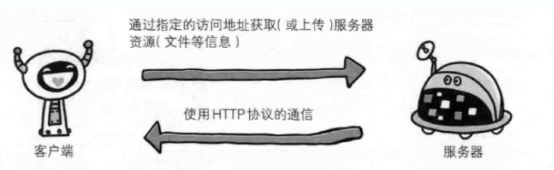
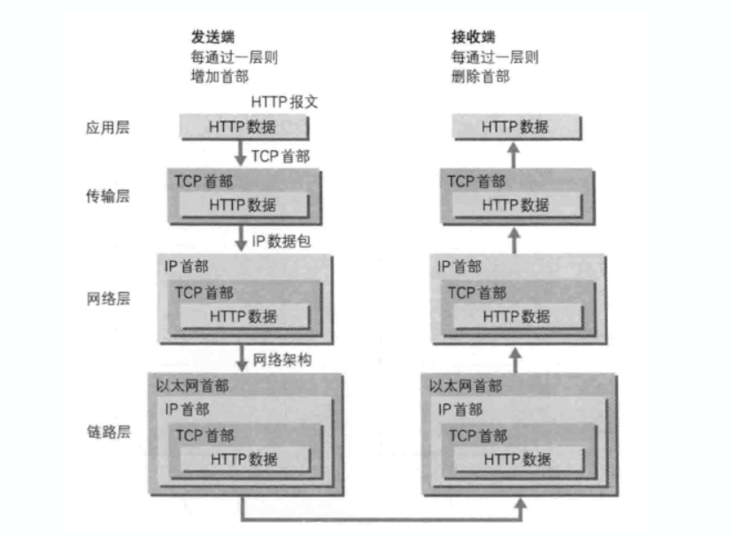
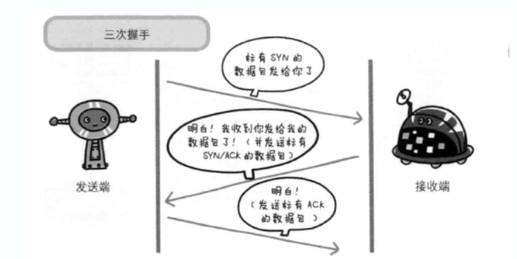
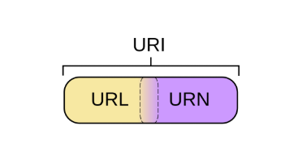

# HTTP图解

[HTTP图解](https://kb.cnblogs.com/page/559838/)

俗话说好的开发，底层知识必须过硬，不然再创新的技术，你也理解不深入，比如python web开发工程师，想要学习任何一个框架，底层都是http和socket，底层抓牢了，学起来会很轻松，所以楼主今天特意写了一篇底层的博客，来源于《HTTP图解》这本书。下载内容在本节末尾，可以自行前去下载观看，比我个人了解得多要全面很多，不过不要忘记点赞哈！！

## 了解web及网络基础
1、使用http协议访问web
当我们用网页浏览器（web browser）的地址栏中输入URL时，Web页面的呈现过程：

输入URL时，可以看到web页面，即使不了解运作原理，也能看到页面
输入URL后，信息会被送往某处
然后从某处获得的回复，内容就会显示在web页面上
　　web页面不可能凭空显示出来，根据web浏览器地址栏中指定的URL，web浏览器会从服务器端获取文件资源等信息，从而显示web页面。

像这一套流程就可以称作是客户端（client）向服务端（server）获取服务器资源

web使用一种名为HTTP（HyperText Transfer Protocol），超文本传输协议作为规范，完成从客户端到服务端等一系列运作过程。而协议是指规则的约定。可以理解成，web是建立在HTTP协议上通信的。

2、网络基础TCP/IP
为了了解HTTP，必须的了解TCP/IP协议族。

通常使用的网络实在TCP/IP协议族的基础上运作的。而HTTP就属于他的一个子集。

2.1、TCP/IP 协议族
　　计算机与网络设备要相互通信，双方就必须基于相同的方法。比如：如何探测到通信目标、由哪一方先发起通信、使用哪种语言等等好多规则。然而这种规则就是所谓的协议（protocol），你要用我就按照我协议的规则来。常用协议有：tcp，http，ftp，dhcp，dns，ip，pppoe，udp，snmp，icmp等等。

像这样把与互联网关联的协议集合起来总称TCP/IP，TCP/IP实在IP协议通信过程中，使用到的协议族的统称

2.2、TCP/ip的分层管理
　　TCP/IP协议族重要的一点就是分层。TCP/IP协议族按层次划分分别是：应用层、传输层、网络层和数据链路层。把塔层次化是有好处的。比如：当某个地方需求变更时，就必须吧所有的整体替换掉。而分层之后只需要把变动的层替换掉即可。下面介绍一下每个层次的作用

应用层

　　应用层决定了向用户提供应用服务时通信的活动。比如：ftp，dns服务就是其中的两类。HTTP协议也处于该层。

传输层

　　传输层对上层应用层，提供处于网络连接中的两台计算机之间的数据传输。在传输层有两个性质不同的协议：TCP和UDP。

网络层

　　网络层用来处理网络上流动的数据包。数据包是网络传输的最小单位。该层规定了通过怎样的路径到达对方计算机，并把数据包发送给对方。

链路层

　　用来处理链接网络的硬件部分。包括操作系统、硬件的设备驱动、网卡及光纤等物理可见部分。

2.3、TCP/IP通信传输流
比如说我想看百度网页：流程如下：

- 客户端在应用层发出一个想看某个WEB页面的HTTP请求的时候；
- 接着为了传输方便，在传输层把应用层收到的数据进行分割，并在各个报文上打上标记序号及端口号后转发给网络层；
- 在网络层增加作为通信目的的MAC地址后转发给链路层，这样一来发送网络的通信请求就准备齐全了；
- 接收端的服务器在链路层接收到数据，按序往上层发送，一直到应用层；
- 当传输到应用层，才能算真正接收到由客户端发送过来的HTTP请求了。

发送端在层与层之间传输数据时，每经过一层时必定会打上一个该层的首部信息。接收端没经过一层，会把消去。这种数据信心包装叫做封装。

TCP/IP传输是三次握手，四次断开。一张图搞定一切，哈哈

3、URI和URL

[URI和URL英文详解](https://danielmiessler.com/study/url-uri/)

URI用字符串标示某一互联网资源，而URL表示资源的地点。可见URL是URI的子集。

[具体说明](https://www.cnblogs.com/chengdabelief/p/6635045.html)

简单理解是这样的：
理解URI和URL的区别，我们引入URN这个概念。

URI = Universal Resource Identifier 统一资源标志符
URL = Universal Resource Locator 统一资源定位符
URN = Universal Resource Name 统一资源名称

也就是说，URI分为三种，URL or URN or （URL and URI）
URL代表资源的路径地址，而URI代表资源的名称。
通过URL找到资源是对网络位置进行标识，如：
http://example.org/absolute/URI/with/absolute/path/to/resource.txt
ftp://example.org/resource.txt
通过URI找到资源是通过对名称进行标识，这个名称在某命名空间中，并不代表网络地址，如：
urn:issn:1535-3613

首先，URL是URI的一种（通过那个图就看的出来吧）。所以有人跟你说URL不是URI，他就错了呗。但也不是所有的URI都是URL哦，就好像蝴蝶都会飞，但会飞的可不都是蝴蝶啊，你让苍蝇怎么想！
让URI能成为URL的当然就是那个“访问机制”，“网络位置”。e.g. http:// or ftp://.。
URN是唯一标识的一部分，就是一个特殊的名字。
　　下面就来看看例子吧，当来也是来自权威的RFC：

ftp://ftp.is.co.za/rfc/rfc1808.txt (also a URL because of the protocol)
http://www.ietf.org/rfc/rfc2396.txt (also a URL because of the protocol)
ldap://[2001:db8::7]/c=GB?objectClass?one (also a URL because of the protocol)
mailto:John.Doe@example.com (also a URL because of the protocol)
news:comp.infosystems.www.servers.unix (also a URL because of the protocol)
tel:+1-816-555-1212
telnet://192.0.2.16:80/ (also a URL because of the protocol)
urn:oasis:names:specification:docbook:dtd:xml:4.1.2
这些全都是URI, 其中有些事URL. 哪些? 就是那些提供了访问机制的.

总结
下面到了回答问题的时候了：

当我们替代web地址的时候，URI和URL那个更准确？

基于我读的很多的文章，包括RFC，我想说URI更准确。

别急，我有我的理由：

我们经常使用的URI不是严格技术意义上的URL。例如：你需要的文件在files.hp.com. 这是URI，但不是URL--系统可能会对很多协议和端口都做出正

确的反应。

你去http://files.hp.com 和ftp://files.hp.com.可能得到完全不同的内容。这种情况可能更加普遍，想想不同谷歌域名上的不同服务啊。

所以，用URI吧，这样你通常技术上是正确的，URL可不一定。最后“URL”这个术语正在被弃用。所以明智吧少年！

