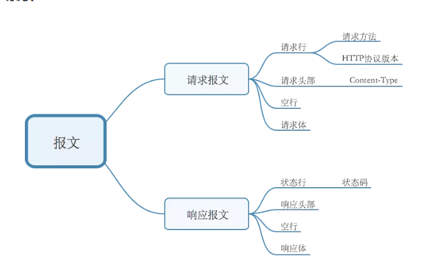

# HTTP请求报文和响应报文
http请求包含：请求报文和响应报文


## 请求报文

### 请求行
请求行由三部分组成：请求方法，请求URL（不包括域名），HTTP协议版本
请求方法

请求方法比较多：GET、POST、HEAD、PUT、DELETE、OPTIONS、TRACE、CONNECT

HTTP协议版本

HTTP/1.0支持：GET、POST、HEAD三种HTTP请求方法。

HTTP/1.1是当前正在使用的版本。该版本默认采用持久连接，并能很好地配合代理服务器工作。还支持以管道方式同时发送多个请求，以便降低线路负载，提高传输速度。

HTTP/1.1新增了：OPTIONS、PUT、DELETE、TRACE、CONNECT五种HTTP请求方法。
### 请求头部
请求头部由关键字/值对组成，每行一对

:::tip 字段说明
User-Agent : 产生请求的浏览器类型
Accept : 客户端希望接受的数据类型，比如 Accept：text/xml（application/json）表示希望接受到的是xml（json）类型
Content-Type：发送端发送的实体数据的数据类型。 比如，Content-Type：text/html（application/json）表示发送的是html类型。
Host : 请求的主机名，允许多个域名同处一个IP地址，即虚拟主机
:::

 Content-Type 

| Content-Type | 解释 |
| :----        | :--- |    
|text/html	|html格式|
|text/plain	|纯文本格式|
|text/css	|CSS格式|
|text/javascript	|js格式|
|image/gif/jpeg/png	|gif/jpeg/png图片格式|
|application/x-www-form-urlencoded	|POST专用：普通的表单提交默认是通过这种方式。form表单数据被编码为key/value格式发送到服务器。|
|application/json	|POST专用：用来告诉服务端消息主体是序列化后的 JSON 字符串|
|text/xml	|POST专用：发送xml数据|
|multipart/form-data	|POST专用：下面讲解|

### 空行
请求头之后是一个空行，通知服务器以下不再有请求头
### 请求体
GET没有请求数据，POST有。

与请求数据相关的最常使用的请求头是 Content-Type 和 Content-Length 。

##  响应报文

### 状态行
状态行也由三部分组成：服务器HTTP协议版本，响应状态码，状态码的文本描述 
比如：HTTP/1.1 200 OK

状态码：由3位数字组成，第一个数字定义了响应的类别


状态行Code

| code | 含义 |
| :----        | :--- |    
|1xx	|指示信息，表示请求已接收，继续处理|
|2xx	|成功，表示请求已被成功接受，处理。|
|3xx	|重定向|
|4xx	|客户端错误|
|5xx	|服务器端错误，服务器未能实现合法的请求。|

:::tip 常用状态行说明
200 OK：客户端请求成功 

204 No Content：无内容。服务器成功处理，但未返回内容。一般用在只是客户端向服务器发送信息，而服务器不用向客户端返回什么信息的情况。不会刷新页面。

206 Partial Content：服务器已经完成了部分GET请求（客户端进行了范围请求）。响应报文中包含Content-Range指定范围的实体内容

301 Moved Permanently：永久重定向，表示请求的资源已经永久的搬到了其他位置。

302 Found：临时重定向，表示请求的资源临时搬到了其他位置

303 See Other：临时重定向，应使用GET定向获取请求资源。303功能与302一样，区别只是303明确客户端应该使用GET访问

307 Temporary Redirect：临时重定向，和302有着相同含义。POST不会变成GET

304 Not Modified：表示客户端发送附带条件的请求（GET方法请求报文中的IF…）时，条件不满足。返回304时，不包含任何响应主体。虽然304被划分在3XX，但和重定向一毛钱关系都没有

> 一个304的使用场景：
缓存服务器向服务器请求某一个资源的时候，服务器返回的响应报文具有这样的字段：Last-Modified:Wed,7 Sep 2011 09:23:24，缓存器会保存这个资源的同时，保存它的最后修改时间。下次用户向缓存器请求这个资源的时候，缓存器需要确定这个资源是新的，那么它会向原始服务器发送一个HTTP请求（GET方法），并在请求头部中包含了一个字段：If-Modified-Since:Wed,7 Sep 2011 09:23:24，这个值就是上次服务器发送的响应报文中的最后修改时间。
假设这个资源没有被修改，那么服务器返回一个响应报文：
```js
  HTTP/1.1 304 Not Modified
  Date：Sat, 15 Oct 2011 15:39:29
  (空行)                                      
  (空响应体)
```
> 用304告诉缓存器资源没有被修改，并且响应体是空的，不会浪费带宽。

400 Bad Request：客户端请求有语法错误，服务器无法理解。

401 Unauthorized：请求未经授权，这个状态代码必须和WWW-Authenticate报头域一起使用。

403 Forbidden：服务器收到请求，但是拒绝提供服务

404 Not Found：请求资源不存在。比如，输入了错误的url

415 Unsupported media type：不支持的媒体类型

500 Internal Server Error：服务器发生不可预期的错误。

503 Server Unavailable：服务器当前不能处理客户端的请求，一段时间后可能恢复正常
:::